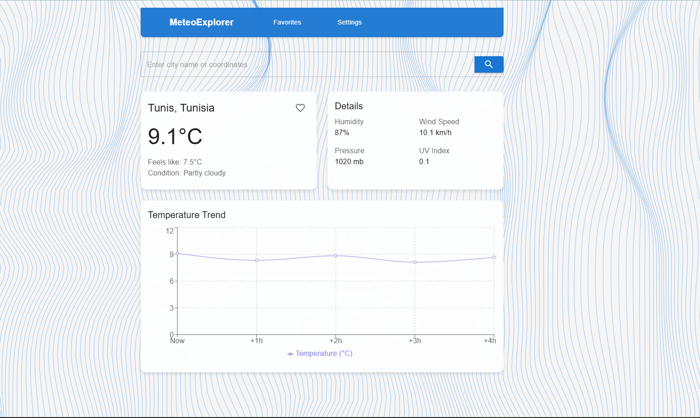

# Meteo App

Une application météo moderne et interactive construite avec React et Vite, offrant des informations météorologiques en temps réel avec une interface utilisateur élégante.

## 🌟 Caractéristiques

- 🎨 Interface utilisateur moderne avec fond animé interactif
- 📊 Visualisation des données météorologiques avec des graphiques
- 🔍 Recherche de météo par ville
- ❤️ Système de favoris pour sauvegarder vos villes préférées
- ⚙️ Page de paramètres personnalisables
- 📱 Design responsive

## 🖼️ Aperçu



## 🛠️ Technologies Utilisées

- React 18
- Vite
- Material-UI
- Framer Motion
- Chart.js
- Tailwind CSS
- React Router DOM

## 🚀 Installation

1. Clonez le repository
   ```bash
   git clone https://github.com/Bechir-Mathlouthi/meteo-app.git
   ```

2. Installez les dépendances
   ```bash
   cd meteo-app
   npm install
   ```

3. Lancez l'application en mode développement
   ```bash
   npm run dev
   ```

## 💻 Scripts Disponibles

- `npm run dev` - Lance l'application en mode développement
- `npm run build` - Crée une version de production
- `npm run preview` - Prévisualise la version de production
- `npm run deploy` - Déploie l'application sur GitHub Pages

## 🌐 Démo en Ligne

Visitez l'application déployée : [Meteo App](https://bechir-mathlouthi.github.io/meteo-app/)

## 📝 License

MIT
